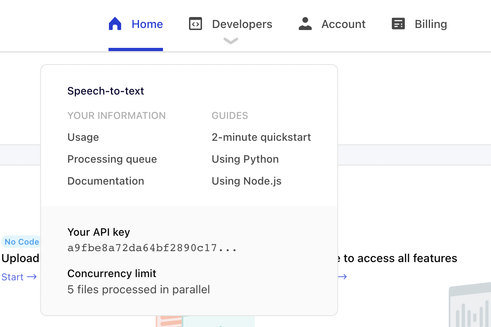

# Project rudi

## Introduction

## Rudi server

The rudi server is a simple HTTP server that communicates with the assemblyai API. It is used to transcribe audio files and return the results to the client.

### Setup

1. Enter the rudi-server directory

```bash
cd rudi-server
```

2. Install the dependencies

```bash
npm install
```

3. Create a `.env` file in the root directory and add the following:

```bash
export ASSEMBLY_AI_API_KEY=your_api_key
```

A example `.env.sample` file is provided in the rudi-server directory.
The API key can be obtained from the [assemblyai website](https://app.assemblyai.com/).
First create an account and then copy the API key.



4. Run the server

```bash
npm start
```

### Usage

The server exposes a single endpoint `/stt` that accepts a `POST` request with a raw body containing the audio file to be transcribed. The server will return a text containing the transcription results.